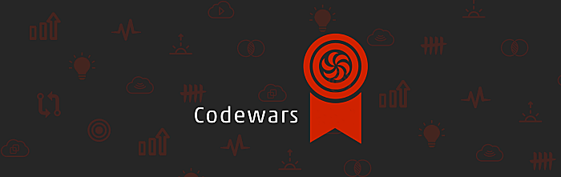

<h1 id="readme-top">MY CODEWARS JOURNEY</h1>
<p class="header">This GitHub repository documents my CodeWars journey—a collection of coding challenges, solutions, and progress as I sharpen my programming skills.</p>

<p align="center">
  <a href="https://github.com/emailjohnthomascaballero">
    
  </a>
</p>

## Table of Contents
<details>
  <summary>VIEW TABLE OF CONTENTS</summary>
  <ol type="I">
    <li><a href="#about">About the Project</a></li>
    <li><a href="#languages">Languages & Tools Used</a></li>
    <li><a href="#project-link">Project Link</a></li>
    <li><a href="#usage">Usage</a></li>
  </ol>
</details>

<p align="right">(<a href="#readme-top">back to top</a>)</p>

<h2 id="about">I. About the Journey</h2>
In this coding journey, I am dedicated to honing my logical thinking and algorithmic skills through CodeWars challenges. This repository serves as a comprehensive showcase of all the code I've crafted during this practice, highlighting my progress and solutions as I navigate the diverse array of coding puzzles on CodeWars.

<!-- Back to Top -->
<p align="right">(<a href="#readme-top">back to top</a>)</p>

<h2 id="languages">II. Languages and Tools Used</h2>

#### Planning


#### Development


<!-- Back to Top -->
<p align="right">(<a href="#readme-top">back to top</a>)</p>

<h2 id="usage">IV. Usage</h2>

_Below is an example of how you can install and setup the application on your device._

1. Clone the repo
   ```sh
   git clone https://github.com/emailjohnthomascaballero/codewars.git
   ```
<!-- Back to Top -->
<p align="right">(<a href="#readme-top">back to top</a>)</p>