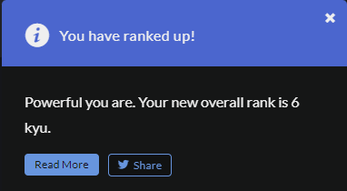

<h1 id="readme-top">MY CODEWARS JOURNEY</h1>
<p class="header">This GitHub repository documents my CodeWars journey—a collection of coding challenges, solutions, and progress as I sharpen my programming skills.</p>

<p align="center">
  <a href="https://github.com/emailjohnthomascaballero/codewars">
    
    
  </a>
</p>

## Table of Contents

<details>
  <summary>VIEW TABLE OF CONTENTS</summary>
  <ol type="I">
    <li><a href="#about">About the Journey</a></li>
    <li><a href="#languages">Languages & Tools Used</a></li>
    <li><a href="#achievements">Achievements</a></li>
    <li><a href="#usage">Usage</a></li>
  </ol>
</details>

<p align="right">(<a href="#readme-top">back to top</a>)</p>

<h2 id="about">I. About the Journey</h2>
In this coding journey, I'm working on improving my problem-solving and coding skills by solving challenges on CodeWars. This collection shows all the code I've written while practicing, showing how I've grown and the solutions I've found to different coding problems.

<!-- Back to Top -->
<p align="right">(<a href="#readme-top">back to top</a>)</p>

<h2 id="languages">II. Languages and Tools Used</h2>

#### Planning


#### Development


#### Libraries


<!-- Back to Top -->
<p align="right">(<a href="#readme-top">back to top</a>)</p>

<h2 id="achievements">III. Achievements</h2>

<p align="center">
  <a href="https://github.com/emailjohnthomascaballero/codewars">
    
    <p align="right">(<a href="#readme-top">back to top</a>)</p>
    
    <p align="right">(<a href="#readme-top">back to top</a>)</p>
    
    <p align="right">(<a href="#readme-top">back to top</a>)</p>
    
    <p align="right">(<a href="#readme-top">back to top</a>)</p>
    
    <p align="right">(<a href="#readme-top">back to top</a>)</p>
    
    <p align="right">(<a href="#readme-top">back to top</a>)</p>
    
    <p align="right">(<a href="#readme-top">back to top</a>)</p>
    
  </a>
</p>

<!-- Back to Top -->
<p align="right">(<a href="#readme-top">back to top</a>)</p>

<h2 id="usage">IV. Usage</h2>

_Below is an example of how you can install and setup the application on your device._

1. Clone the repo
   ```sh
   git clone https://github.com/emailjohnthomascaballero/codewars.git
   ```
   <!-- Back to Top -->
   <p align="right">(<a href="#readme-top">back to top</a>)</p>
